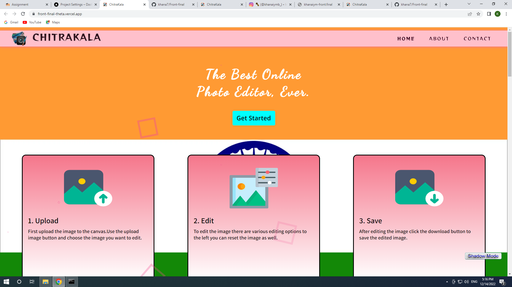
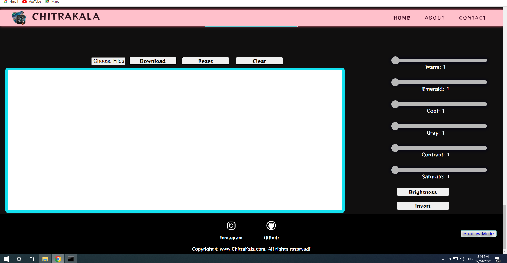

# Front-final

<h1>ABOUT PROJECT:</h1>

Our project topic is an IMAGE EDITOR WEBSITE and i have named it CHITRAKALA THIS IS an iNDIAN  . This image editor website consists of 3 different section to which we can navigate with the help of navbar. The three different pages are Home section, About Us section and Contact section.

At the end of  page there are icons which are linked to my social media accounts of Instagram and Github.

This website enables the user to add multiple combinations of different filters provided in the editor section, to the images they upload and then download the same.

